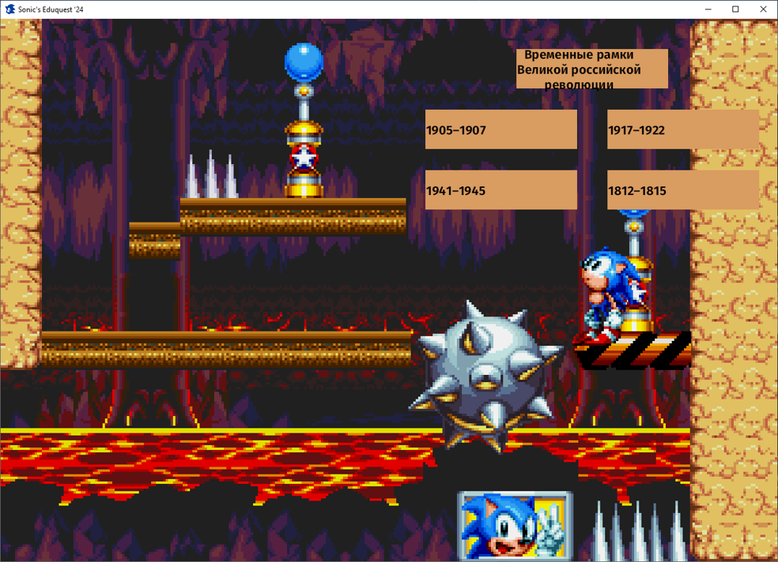

### [Русская Версия](./README_RU.md)

# Sonic's Eduquest 2

**Sonic's Eduquest 2**, also referred to as **Sonic The Hedgehog E**, is a short puzzle sidescroller game developed in Bevy 0.12 and the remake of [the last year's project](https://github.com/blazingzephyr/sonic-eduquest).

## ⚠ Warning!

This game is in Russian, so it might not be suitable for non-Russophones!

## 🛠 State of Development

The project has been archived after being completed and can now be accessed for reference and portfolio purposes.

## 📝 Goals

This project was developed as a part of a school dissertation project.

## 📃 Features & Capabilities

Set of features implemented in the game:

* Basic movement (this time including jumps).
* Interactable objects, for example, spikes.
* Action input system.
* Three different menus and two fully-fledged puzzle rooms.

## 🛡 Download

You can get the latest release [here](https://github.com/blazingzephyr/sonic-eduquest2/releases/tag/1.0).

## 📂 Installation

If you have downloaded the release, the installation is as simple as extracting an archive.

## ⚙ Build from Source

Alternatively, you could build the game yourself using Bevy.

## 💡 Author

* ZaBlazzingZephyrus ([@blazingzephyr](https://github.com/blazingzephyr))

## 📜 License

The game and its source code are distributed under the [MIT license](https://opensource.org/license/mit/). See [LICENSE](https://github.com/blazingzephyr/sonic-eduquest2/blob/develop/LICENSE).

In short, you are allowed to redistribute and modify this game for both personal and commercial use.
However, you do not have any guarantees.

## 📸 Screenshots

|  |  |
|:--------------------------------------------:|:-----------------------------------------:|
| Main Menu                                    | Room 1                                    |
|   |    |
| Ditto                                        | Room 2                                    |
