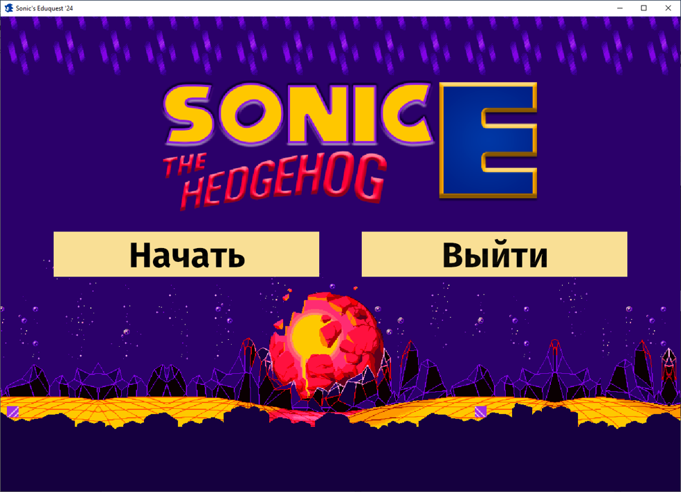
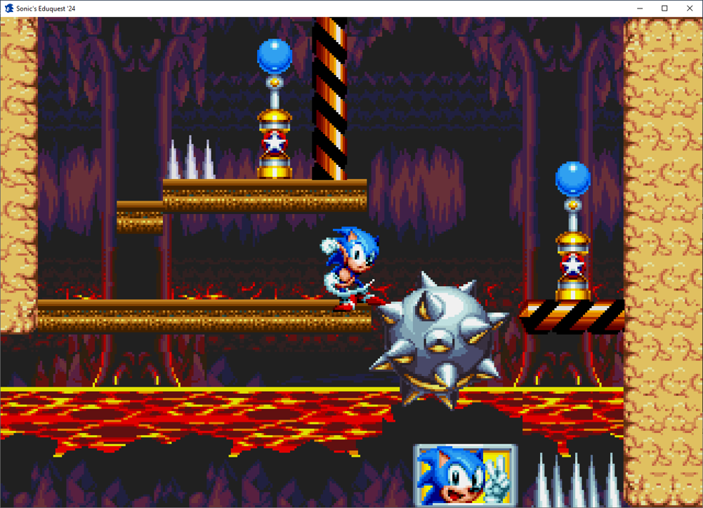
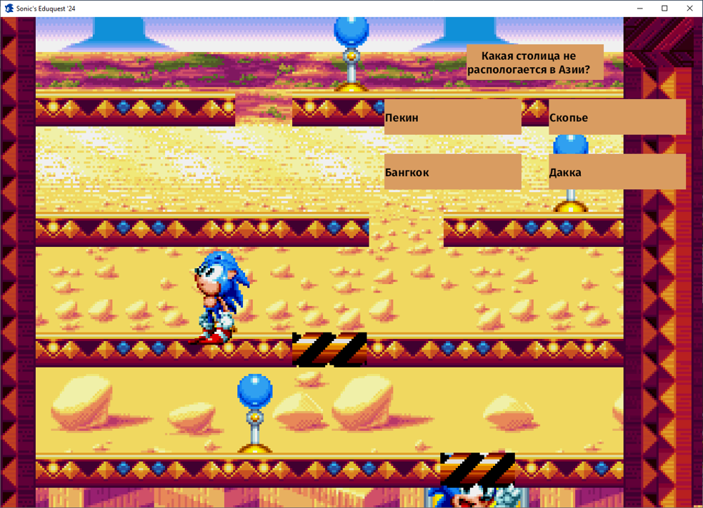

### [English Version](./README.md)

# Sonic's Eduquest 2

**Sonic's Eduquest 2**, также известный как **Sonic The Hedgehog E** — короткий сайдскроллер-паззл, разработанный на Bevy 0.12, [ремейк моей прошлогодней работы](https://github.com/blazingzephyr/sonic-eduquest/blob/develop/README_RU.md).

## 🛠 Состояние Разработки

Данный проект был заархивирован после завершения и ныне доступен как часть портфолио.

## 📝 Цели

Этот проект был разработан как часть школьной дипломной работы.

## 📃 Возможности

Список возможностей, добавленых в игру:

* Простое движение (на этот раз включая прыжки).
* Объекты, с которыми можно взаимодействовать, например, шипы.
* Система взаимодействия.
* Три различных меню и две полностью доделанных комнаты.

## 🛡 Скачать

Вы можете скачать последний релиз [здесь](https://github.com/blazingzephyr/sonic-eduquest2/releases/tag/1.0).

## 📂 Установка

Если Вы скачали релиз, то для установки будет достаточно распаковать архив.

## ⚙ Сборка Исходников

Также, Вы могли бы собрать исходники самостоятельно при помощи Bevy.

## 💡 Автор

* ZaBlazzingZephyrus ([@blazingzephyr](https://github.com/blazingzephyr))

## 📜 Лицензия

Игра и её исходный код распространяются под [MIT лицензией](https://opensource.org/license/mit/). Посмотрите [LICENSE](https://github.com/blazingzephyr/sonic-eduquest2/blob/develop/LICENSE).

Вкратце, Вам разрешено распространять и модифицировать эту игру для личных и коммерческих целей.
Однако, никакие гарантии Вам не предоставляются.

## 📸 Скриншоты

|  |  |
|:--------------------------------------------:|:-----------------------------------------:|
| Главное меню                                 | Комната 1                                 |
|   |    |
| То же                                        | Комната 2                                 |
